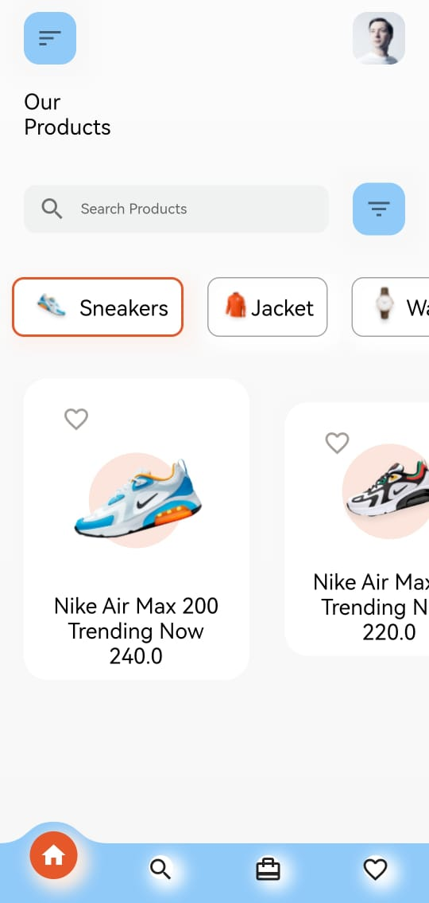
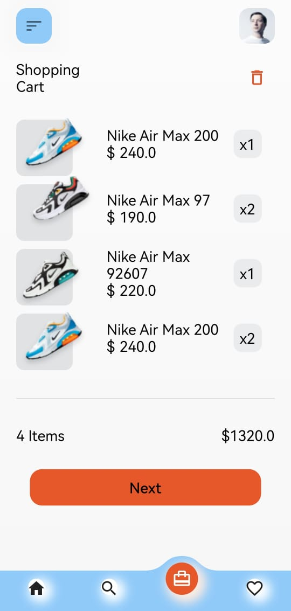

Slide 1: Title slide

View the title of the project: "Comprehensive Ecommerce Project: An Integrated Platform for Buying and Selling Online."

Slide 2: Issue overview

Discuss the challenges consumers and sellers face in e-commerce.
Highlight the need for a comprehensive ecommerce platform that meets everyone's needs.
He stressed the importance of offering a solution that combines all aspects of e-commerce in one place.
Slide 3: Introduction to an Ecommerce Project

The project, which was developed using modern technology, presented to build an integrated e-commerce platform.
He explained that the platform provides a wide range of services related to e-commerce.
Mention the main benefits of the project.

Slide 4: Key Features of the App

Discuss the most important features of the app and platform, such as:
User-friendly user interface: It makes buying and selling easy and enjoyable.
Online Store: Allows sellers to create their own online stores.
Secure payment system: It provides secure and diverse payment methods for consumers.
Powerful search engine: Buyers can search for products easily and quickly.
Shipment Tracking: Allows buyers to track the status of their orders and shipments.

Slide 5: Presentation

Present the audience with a view of the platform by endorsing screens directly from the app or website.
Show how to add products to sell and how to buy.
The most prominent features of communication between sellers and buyers.

Slide 6: Benefits and Impact

Discuss the benefits and positive impact of a comprehensive ecommerce project:
Provide a comprehensive platform for sellers and buyers that can improve the ecommerce experience.
Increase opportunities for SMEs to reach new customers.
Improve the marketing experience for brands and sellers.

Slide 7: Expansion and development of the project

Provide a plan for future project expansion, such as:
Expanding the geographical scope of the project to reach international markets.
Provide additional services such as social shopping or monthly subscription.
Partnerships with shipping and payment companies to improve service options.
Expansion into other areas such as financial services related to e-commerce.

Slide 8: Conclusion

Provide a summary of the main points discussed in the presentation.
He stressed the importance of a comprehensive e-commerce project in improving the online buying and selling experience.
Express your gratitude to the attendees for their time and attention.

 
You can see the screenshots of the application from [screenshots](#screenshots) part.

A few resources to get you started if this is your first Flutter project:
- [Lab: Write your first Flutter app](https://docs.flutter.dev/get-started/codelab)
- [Cookbook: Useful Flutter samples](https://docs.flutter.dev/cookbook)

For help getting started with Flutter development, view the
[online documentation](https://docs.flutter.dev/), which offers tutorials,
samples, guidance on mobile development, and a full API reference.

## Screenshots

